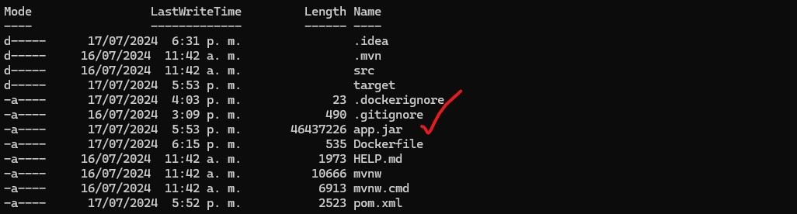
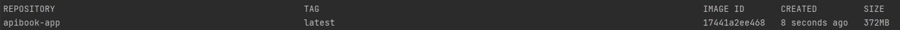
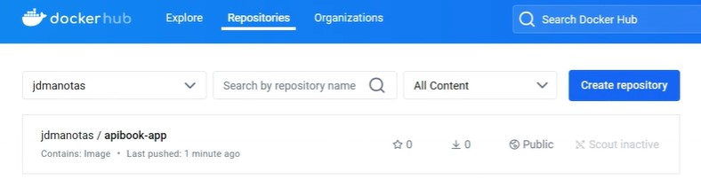

# biblio-book
[](https://www.docker.com/)
[](https://docs.docker.com/compose/)
[](https://www.postgresql.org/)

## Description
Este archivo `docker-compose.yml` define y configura un contenedor de servicio PostgreSQL usando Docker Compose. La versión de Compose especificada es la 3.7.

```yaml
version: '3.7'  # Especifica la versión de Docker Compose a utilizar.

services:  # Define los servicios que se van a crear.
  postgres-biblio:  # Nombre del servicio.
    image: postgres:14.1  # Imagen de Docker a utilizar, en este caso PostgreSQL versión 14.1.
    restart: always  # Configuración de reinicio, el contenedor se reiniciará siempre en caso de fallos.
    environment:  # Variables de entorno para la configuración de la base de datos.
      - POSTGRES_DB=bibliodb  # Nombre de la base de datos que se creará al iniciar el contenedor.
      - POSTGRES_USER=jdmanotas  # Nombre de usuario para acceder a la base de datos.
      - POSTGRES_PASSWORD=Calidad2020*-  # Contraseña del usuario de la base de datos.
    ports:  # Configuración de puertos.
      - '5434:5432'  # Mapea el puerto 5434 del host al puerto 5432 del contenedor, donde PostgreSQL escucha por defecto.
    volumes:  # Configuración de volúmenes.
      - ./data/:/var/lib/postgresql/data  # Monta el directorio local ./data en el directorio del contenedor para persistir los datos.
```

## Detalles y Explicación
- **version:**
Especifica la versión del formato de Docker Compose que se está utilizando. La versión 3.7 es compatible con las versiones recientes de Docker Engine.
- **services:**
Define los servicios que Docker Compose debe gestionar. En este caso hay un solo servicio llamado que lo estamos llamando postgres-biblio.
- **image:**
Especifica la imagen de Docker que se utilizará para este servicio. Aquí usamos la imagen oficial de PostgreSQL en su versión 14.1.
- **restart:**
Configura la política de reinicio del contenedor. Esta opción always asegura que el contenedor se reinicie automáticamente si se detiene o falla.
- **environment:**
Define las variables de entorno que se pasan al contenedor. Con estas variables configuramos la base de datos inicial de PostgreSQL.
    - **POSTGRES_DB**
    Este parametro corresponde al nombre de la base de datos que se creará al iniciar el contenedor (bibliodb).
    - **POSTGRES_USER**
    Este parametro corresponde al nombre del usuario de la base de datos (jdmanotas).
    - **POSTGRES_PASSWORD**
    Este parametro corresponde a la contraseña que se asigna para el usuario de la base de datos (Calidad2020*-)
- **ports:**
Mapea los puertos del contenedor a los puertos del host (maquina anfitriona).
    - **'5434:5432':** Mapea el puerto 5434 del host al puerto 5432 del contenedor esto permite el acceso a PostgreSQL desde el host a través del puerto 5434.
- **volumes:**
Montaje de volúmenes permitiendo la persistencia de datos.
    - **./data/:/var/lib/postgresql/data**
    Monta el directorio local en el directorio ./data
    - **/var/lib/postgresql/data** 
    Esto asegura que los datos de la base de datos persistan entre reinicios y recreaciones del contenedor.

## Ejecutar Contenedor en Docker
Para correr el archivo docker-compose.yml y crear el contenedor de la base de datos PostgreSQL se debe ejecutar el siguiente comando:
- **Ejecutar Docker Compose:**
```
docker-compose up -d
```
- **Verificar el contenedor creado:**
```
docker ps
```

## Script creacion Tablas en Postgresql

El siguiente script SQL crea dos tablas relacionadas en la base de datos: bibliodb, junto con sus índices y restricciones para asegurar la integridad de los datos. 
A continuación explicamos el script:
- script-db.sql

## TABLA autor
```
CREATE TABLE public.autor (
    id bigserial primary key,
    code uuid NULL DEFAULT uuid_generate_v4(),
    identification varchar(14) NOT NULL,
    nombres varchar(32) NOT NULL,
    apellidos varchar(32) NOT NULL,
    email varchar(42) NOT NULL,
    status int4 NULL DEFAULT 1,
    user_reg varchar(12) NOT NULL,
    user_mod varchar(12) NULL,
    created_at timestamp NULL DEFAULT CURRENT_TIMESTAMP,
    updated_at timestamp NULL,
    CONSTRAINT autor_identification_unique UNIQUE (identification),
    CONSTRAINT autor_email_unique UNIQUE (email)
);

CREATE INDEX idx_autor_email ON public.autor USING btree (email);
CREATE INDEX idx_autor_identification ON public.autor USING btree (identification);
```

- **Campos de la tabla autor:**
    - **id:** Identificador único del autor, autoincremental.
    - **code:** UUID generado automáticamente para cada registro.
    - **identification:** Número de identificación del autor, único y no null (cedula, pasaporte,cedula extranjeria).
    - **nombres:** Nombre del autor (Primer Nombre y Segundo Nombre en caso que lo tenga).
    - **apellidos:** Apellidos del autor (Primer Apellido y Segundo Apellido en caso que lo tenga).
    - **email:** Correo electrónico del autor único y no null.
    - **status:** Estado del registro (puede indicar si está activo, inactivo, etc.).
    - **user_reg:** Usuario que registró el autor.
    - **user_mod:** Usuario que modificó por última vez el registro del autor.
    - **created_at:** Fecha y hora de creación del registro, valor predeterminado como la fecha y hora actuales.
    - **updated_at:** Fecha y hora de la última modificación del registro (inicialmente nulo).

        **Restricciones (CONSTRAINT):**
        - **autor_identification_unique**: Garantiza que no haya dos autores con el mismo número de identificación.
        - **autor_email_unique**: Garantiza que no haya direcciónes de correo electrónico de autor duplicada, es decir debe ser unico el correo electronico.

        **Índices (INDEX):**
        - **idx_autor_email**: Crea un índice B-tree en el campo email, lo cual mejora la eficiencia de las consultas que se filtren o busquen por correo electrónico.
        - **idx_autor_identification**: Índice B-tree en el campo identification para optimizar las consultas que utilicen este campo como filtro.

## TABLA libro
```
CREATE TABLE public.libro (
    id bigserial primary key,
    code uuid NULL DEFAULT uuid_generate_v4(),
    idautor bigint NOT NULL,
    isbn varchar(18) NOT NULL,
    nombre varchar(32) NOT NULL,
    status int4 NULL DEFAULT 1,
    user_reg varchar(12) NOT NULL,
    user_mod varchar(12) NULL,
    created_at timestamp NULL DEFAULT CURRENT_TIMESTAMP,
    updated_at timestamp NULL,
    CONSTRAINT libro_isdn_unique UNIQUE (isbn),
    CONSTRAINT fk_idautor FOREIGN KEY (idautor) REFERENCES autor(id)
);
```

- **Campos de la tabla libro:**
    - **id:** Identificador único del autor, autoincremental.
    - **code:** UUID generado automáticamente para cada registro.
    - **idautor:** Clave foránea que referencia el ID del autor en la tabla autor asegurando la integridad referencial..
    - **isbn:** Número de ISBN del libro, único y no nulo.
    - **nombre:** Nombre del libro.
    - **status:** Estado del registro (puede indicar si está activo, inactivo, etc.).
    - **user_reg:** Usuario que registró el autor.
    - **user_mod:** Usuario que modificó por última vez el registro del autor.
    - **created_at:** Fecha y hora de creación del registro, valor predeterminado como la fecha y hora actuales.
    - **updated_at:** Fecha y hora de la última modificación del registro (inicialmente nulo).

        **Restricciones (CONSTRAINT):**
        - **libro_isdn_unique**: Garantiza que no haya dos libros con el mismo número isdn.
        - **fk_idautor**: Restricción de clave foránea que conecta idautor en libro con id en autor, garantizando que todos los libros estén asociados a un autor válido.

         **Índices (INDEX):**
        - **idx_libro_nombre**: Crea un índice B-tree en el campo nombre, lo cual mejora la eficiencia de las consultas que se filtren o busquen por nombre del libro.
        - **idx_libro_isbn**: Índice B-tree en el campo isbn  para optimizar las consultas que utilicen este campo como filtro.

## PRUEBAS API
- **Metodos API autor:**

    **Crear Autor**
    ```
    Metodo: POST
    URL: http://localhost:8091/api/v1/autor
    
    Body:
    {
        "identificacion": "79855645",
        "nombres": "Juanes",
        "apellidos": "Paz",
        "email": "juan.perez1@gmail.com",
        "user_reg": "admin"
    }
    
    Resultado:

    {
        "id": 1,
        "code": "bc3bd7ac-e411-42cd-be4c-11c78ea4e2e4",
        "status": 1,
        "user_reg": "admin",
        "user_mod": null,
        "created_at": "2024-07-17T12:04:20.0617051",
        "updated_at": null,
        "identificacion": "79855645",
        "nombres": "Juanes",
        "apellidos": "Paz",
        "email": "juan.perez1@gmail.com",
        "libros": []
    }

    ```

    **Listar Autores**
    ```
    Metodo: GET
    URL: http://localhost:8091/api/v1/autores
    
    Resultado:

    [
        {
            "id": 1,
            "code": "bc3bd7ac-e411-42cd-be4c-11c78ea4e2e4",
            "status": 1,
            "user_reg": "admin",
            "user_mod": null,
            "created_at": "2024-07-17T12:04:20.061705",
            "updated_at": null,
            "identificacion": "1001001001",
            "nombres": "Juan",
            "apellidos": "Castillo",
            "email": "juan.castillo@gmail.com",
            "libros": []
        },
        {
            "id": 2,
            "code": "8d8f1b40-e80e-4a11-b8f7-522b9957b746",
            "status": 1,
            "user_reg": "admin",
            "user_mod": null,
            "created_at": "2024-07-17T12:11:06.87643",
            "updated_at": null,
            "identificacion": "79800200",
            "nombres": "Gabriel",
            "apellidos": "Garcia Marquez",
            "email": "gabriel.garcia.marquez@yahoo.com",
            "libros": []
        }
    ]
    ```

    **Actualizar Autor**
    ```
    Metodo: PUT
    Parametro: recibe el idAutor que se va actualizar 
    URL: http://localhost:8091/api/v1/autor/1

    Body:

    {
        "identificacion": "1001001001",
        "nombres": "Juan",
        "apellidos": "Castillo",
        "email": "juan.castillo@gmail.com",
    }
    
    Resultado:

    {
        "id": 1,
        "code": "bc3bd7ac-e411-42cd-be4c-11c78ea4e2e4",
        "status": 1,
        "user_reg": "admin",
        "user_mod": null,
        "created_at": "2024-07-17T12:04:20.061705",
        "updated_at": null,
        "identificacion": "1001001001",
        "nombres": "Juan",
        "apellidos": "Castillo",
        "email": "juan.castillo@gmail.com",
        "libros": []
    }

    ```

    **Eliminar Autor**
    ```
    Metodo: DELETE
    Parametro: recibe el idAutor que se va eliminar 
    URL: http://localhost:8091/api/v1/autor/1
    
    Resultado:

    Status: 204 --> Fue eliminado con exito.

    ```

- **Metodos API libro:**

    **Crear Libro**
    ```
    Metodo: POST
    URL: http://localhost:8091/api/v1/libro
    
    Body:
    {
        "isbn": "978-1-4028-9462-6",
        "nombre": "La Odisea",
        "user_reg": "admin",
        "autor": {
            "id": 1
        }
    }
    
    Resultado:

    {
        "id": 1,
        "code": "dc4897fb-af48-44a7-b7da-11ebb9798428",
        "status": 1,
        "user_reg": "admin",
        "user_mod": null,
        "created_at": "2024-07-17T15:12:40.4765832",
        "updated_at": null,
        "isbn": "978-1-4028-2222-6",
        "nombre": "Las revelion de las ratas",
        "autor": {
            "id": 1,
            "code": "937e8b82-cec4-44bb-bbd4-b15278e80837",
            "status": 1,
            "user_reg": "admin",
            "user_mod": null,
            "created_at": "2024-07-17T15:12:40.4765832",
            "updated_at": null,
            "identificacion": null,
            "nombres": null,
            "apellidos": null,
            "email": null,
            "libros": []
        }
    }

    ```

    **Listar Libros**
    ```
    Metodo: GET
    URL: http://localhost:8091/api/v1/libros
    
    Resultado:

    [
        {
            "id": 1,
            "code": "dc4897fb-af48-44a7-b7da-11ebb9798428",
            "status": 1,
            "user_reg": "admin",
            "user_mod": null,
            "created_at": "2024-07-17T15:12:40.476583",
            "updated_at": null,
            "isbn": "978-1-4028-2222-6",
            "nombre": "Las revelion de las ratas",
            "autor": {
                "id": 1,
                "code": "c8fa8205-73b9-4490-8a6b-3395dde61af6",
                "status": 1,
                "user_reg": "admin",
                "user_mod": null,
                "created_at": "2024-07-17T15:11:41.327758",
                "updated_at": null,
                "identificacion": "79800200",
                "nombres": "Gabriel",
                "apellidos": "Garcia Marquez",
                "email": "gabriel.garcia.marquez@yahoo.com"
            }
        },
        {
            "id": 2,
            "code": "6a75ca40-fa80-4a3f-a528-751110557c9f",
            "status": 1,
            "user_reg": "admin",
            "user_mod": null,
            "created_at": "2024-07-17T15:40:18.063408",
            "updated_at": null,
            "isbn": "978-1-4028-7777-6",
            "nombre": "Ilusion de un Principiante",
            "autor": {
                "id": 3,
                "code": "b1538311-bf17-4ad7-a7da-0e4ddbf476a3",
                "status": 1,
                "user_reg": "admin",
                "user_mod": null,
                "created_at": "2024-07-17T15:39:33.031076",
                "updated_at": null,
                "identificacion": "66666",
                "nombres": "Claudia",
                "apellidos": "Ferrero",
                "email": "claudia.ferrero@gmail.com"
            }
        }
    ]
    ```

    **Actualizar Libro**
    ```
    Metodo: PUT
    Parametro: recibe el idAutor que se va actualizar 
    URL: http://localhost:8091/api/v1/libro/1

    Body:

    {
        "isbn": "999-0-06-112225-9",
        "nombre": "Cronicas de una muerte anunciada",
	    "user_mod": "admin"
    }
    
    Resultado:

    {
        "id": 1,
        "code": "dc4897fb-af48-44a7-b7da-11ebb9798428",
        "status": 1,
        "user_reg": "admin",
        "user_mod": null,
        "created_at": "2024-07-17T15:12:40.476583",
        "updated_at": null,
        "isbn": "999-0-06-112225-9",
        "nombre": "Cronicas de una muerte anunciada",
        "autor": {
            "id": 1,
            "code": "c8fa8205-73b9-4490-8a6b-3395dde61af6",
            "status": 1,
            "user_reg": "admin",
            "user_mod": null,
            "created_at": "2024-07-17T15:11:41.327758",
            "updated_at": null,
            "identificacion": "79800200",
            "nombres": "Gabriel",
            "apellidos": "Garcia Marquez",
            "email": "gabriel.garcia.marquez@yahoo.com"
        }
    }

    ```

    **Eliminar Libro**
    ```
    Metodo: DELETE
    Parametro: recibe el idLibro que se va eliminar 
    URL: http://localhost:8091/api/v1/libro/4
    
    Resultado:

    Status: 204 --> Fue eliminado con exito.

    ```

## COMPILACION DELPROYECTO
## Generacion del archivo *.jar con mave
Nos ubicamos en la carpeta del proyecto y corremos el comando:

```
mvn clean package
```

A continuacion la imagen:




## CREACION DE LA IMAGEN DOCKER (contenedor)
## Archivo Dockerfile

```
    # Usa una imagen base de OpenJDK 17 en Alpine para reducir el tamaño de la imagen
    FROM openjdk:17-jdk-alpine

    # Establece el directorio de trabajo dentro del contenedor
    WORKDIR /app

    # Copia el archivo JAR generado por Maven (asegúrate de que el nombre del archivo JAR sea correcto)
    COPY ./app.jar app.jar

    # Define el comando de entrada para ejecutar la aplicación Spring Boot
    ENTRYPOINT ["java", "-jar", "app.jar"]

    # Expone el puerto en el que la aplicación Spring Boot está configurada para escuchar
    EXPOSE 8091
```

## Comando crear imagen Docker

```
    docker build -t apibook-app .
```

## IMAGEN GENERADA A PARTIR DEL Dockerfile
## Imagen Docker




## IMAGEN EN DOCKERHUB
## Comandos Upload (repositorio)
```

    docker tag apibook-app:latest jdmanotas/apibook-app:latest
    docker login
    docker push jdmanotas/apibook-app:latest

```

## Imagen en Repositorio Dockerhub (repositorio)



## Comando para bajar Imagen en Repositorio Dockerhub (repositorio)


```
    docker pull jdmanotas/apibook-app
```
